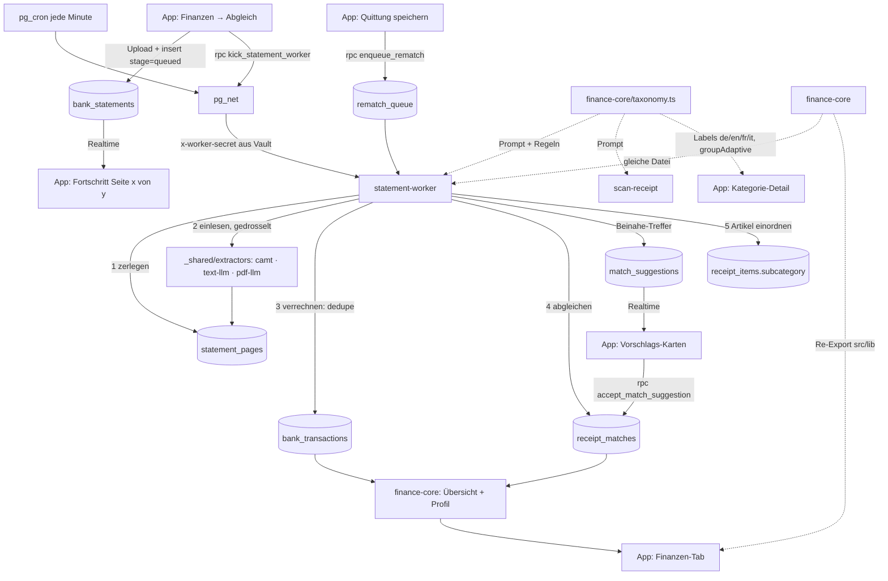

# ARCHITECTURE.md — Piggy

> **LLM-Hinweis:** Lies diese Datei und `docs/adr/` vor Änderungen an Finanzlogik, Kontoauszug-Pipeline, Abgleich oder Kategorien. Dokumentiert Kopplungen, die bei Änderungen mitgezogen werden müssen.

## Intent & Constraints

**Ziel:** Quittungen scannen + Kontoauszüge importieren = komplette Finanzübersicht. Bank-Ausgaben werden über verknüpfte Quittungen bis auf Artikel-Ebene kategorisiert; Ungereimtheiten (Trinkgeld, Fremdwährung, Rabatt) werden als Vorschläge angeboten.

| Constraint | Begründung |
|-----------|-----------|
| Finanzlogik nur in `supabase/functions/_shared/finance-core/` | App (Metro/Jest) und Edge Functions (Deno) nutzen dieselbe Quelle; `src/lib/{categories,finance,matching,discrepancies,profile}.ts` sind reine Re-Exports |
| In `finance-core` und `extractors`: relative Imports mit `.ts`, keine npm/RN/Supabase-Imports | Deno verlangt Endungen; App kompiliert dieselben Dateien (`allowImportingTsExtensions`) |
| Kontoauszüge werden nur serverseitig verarbeitet (statement-worker) | Grosse PDFs (10–40 Seiten, ~1000 Buchungen) sprengen ein synchrones Edge-Limit und dürfen nicht an offener App hängen (ADR 0001) |
| Pro Artikel genau eine Hauptkategorie (`receipt_items.tags[0]`) + optional eine Unterkategorie (`receipt_items.subcategory`) | Taxonomie in `finance-core/taxonomy.ts` (ADR 0002); Hauptkategorie-ID = stabiler deutscher Name in der DB, Anzeige-Labels pro Sprache; Alt-Tags über `LEGACY_TAG_CATEGORY` |
| Unterkategorie muss zur Hauptkategorie gehören | `resolveSubcategory` (App) bzw. `resolveClassification` (Worker) prüfen das vor jedem Schreiben |
| Umbuchungen zählen nie als Ausgabe/Einnahme | Kreditkarten-Rechnung vom Konto + Kreditkarten-Auszug wären sonst doppelt |
| Secrets nie im Code: Worker-Auth über Vault (`statement_worker_secret`), LLM-Key als Function-Env | Cron/App rufen den Worker, ohne den Service-Key zu kennen |

## Dependency & Contract Matrix

| Komponente | Triggert durch | Output | Hard Dependencies |
|-----------|--------------|--------|------------------|
| `app/scan.tsx` | User speichert Quittung | `receipts`, `receipt_items` (tags + subcategory), RPC `enqueue_rematch` | `src/lib/ocr.ts` → `normalizeItems` (gültige Unterkategorie bestimmt die Hauptkategorie) |
| `scan-receipt` (Edge) | OCR-Text aus der App | Quittungs-JSON mit `tags` + `subcategory` je Artikel | Prompt aus `taxonomy.receiptItemCategoryPrompt()` — gleicher Abschnitt im Gemini-BYOK-Prompt (`ocr.ts`) |
| `app/receipt/[id].tsx` | User bearbeitet Artikel | `receipt_items` mit `classified_at = now()` | Hintergrund-Einordnung fasst geprüfte Artikel nie mehr an |
| `src/hooks/useBankStatements.ts` | Upload im Finanzen-Tab | Storage `bank-statements/{uid}/…`, `bank_statements(stage=queued)`, RPC `kick_statement_worker` | KI-Einwilligung (`aiConsent`) vor Upload |
| `statement-worker` (Edge) | pg_cron jede Minute, Kick | `statement_pages`, `bank_transactions`, `receipt_matches`, `match_suggestions`, Fortschritt in `bank_statements` | RPCs `claim_*` (SKIP LOCKED), `app_settings.statement_*`, `_shared/extractors`, `_shared/finance-core` |
| `_shared/extractors` | Worker pro Seite | `ParsedLine[]` + Tokens/Modell | `ANTHROPIC_API_KEY`; Modelle aus `app_settings` |
| `_shared/classify/items.ts` | Worker Schritt 5 (wenn Zeit übrig) | `receipt_items.subcategory`, ggf. korrigierte Hauptkategorie | RPC `claim_items_to_classify` (subcategory IS NULL AND classified_at IS NULL); `RELATED_MOVES` begrenzt Kategorie-Wechsel |
| `finance-core/matching.ts` | Worker (Abgleich) | exakte 1:1-Treffer | Score Betrag 50 / Datum 30 / Händler 20, Schwelle 0.6 |
| `finance-core/discrepancies.ts` | Worker nach Abgleich | Vorschläge tip/fx/discount/partial/other | nutzt `dateScore`/`merchantScore`/`scoreMatch` aus matching |
| `finance-core/finance.ts` / `profile.ts` | Finanzen-Tab | Monatsübersicht, Finanzprofil (Woche/Monat) | Kategorien aus `categories.ts`; `buildPeriodOverview` ist die einzige Summenlogik |
| RPC `accept_match_suggestion` | User übernimmt Vorschlag | Verknüpfung + Ausgleichsposten (`receipt_items.is_adjustment`) | SECURITY INVOKER → RLS des Users |

## Mermaid Dependency Graph

## Invariants

1. **Eine Quelle für Finanzlogik** — nie Logik in `src/lib/*` duplizieren; neue Funktion in `finance-core` + Re-Export.
2. **Claims immer über RPC mit `FOR UPDATE SKIP LOCKED`** — Cron und Kick laufen parallel.
3. **Verrechnen dedupliziert gegen alle Buchungen im Zeitraum (paginiert)** — Re-Import oder Retry darf nie doppelte Buchungen erzeugen.
6. **Vorzeichen per Saldo-Kette korrigieren** (`extractors/balance.ts`) — der Text-Layer verliert die Soll/Haben-Spalte; vor dem Verrechnen läuft die Kette seitenübergreifend.
7. **Plausibilität pro Seite** — liefert das Text-Modell < 75 % der Datumszeilen, wird die Seite per Vision (pdf-llm) nachgelesen; Rohausgabe steht in `statement_pages.raw_output`.
8. **Keine stillen Zeilenverluste** — eine Datenzeile der Modell-Antwort, deren Betrag nicht lesbar ist, lässt die Seite scheitern (`parseStrict`): auto → Vision-Fallback, sonst Retry und sichtbarer Fehler. `parseAmount` versteht Unicode-Minus, nachgestelltes Minus und Klammern.
9. **Vom User geprüfte Artikel bleiben, wie sie sind** — `classified_at` gesetzt ⇒ kein Hintergrund-Reklassifizieren.
4. **Vorschläge werden nie automatisch angenommen** — nur User-Aktion (`accept_match_suggestion`); abgelehnte Paare werden nie erneut vorgeschlagen (UNIQUE `transaction_id, receipt_id`).
5. **Original-Total einer Quittung bleibt unverändert** — Differenzen nur als `is_adjustment`-Artikel.

## Refactoring-Guides

### Anderes LLM / effizienteres Einlesen
1. Nur Modell tauschen: `app_settings.statement_text_model` / `statement_pdf_model` ändern (kein Deploy).
2. Neues Verfahren: Extractor in `_shared/extractors/` (Interface `ExtractResult`), in `index.ts` registrieren, `statement_extractor` setzen; Worker neu deployen.
3. Kosten/Qualität vergleichen über `statement_pages.extractor, model, tokens_in, tokens_out, ms`.

### Drossel / Last anpassen
`app_settings.statement_pages_per_tick`, `statement_page_concurrency`, `statement_max_attempts`; Takt in `cron.job` (`statement-worker`).

### Neue Unterkategorie / Kategorie umbenennen
1. `finance-core/taxonomy.ts`: Eintrag mit Art (essential/treat/occasional), Labels in allen 4 Sprachen **sinngemäss** (nicht wörtlich), optional Regex.
2. Hauptkategorie-ID nie umbenennen (steht in der DB) — nur `label` ändern. Neue Hauptkategorie: Eintrag + ggf. `CLASSIFY_ORDER`, `RELATED_MOVES`, Worker-Prompt-Hinweis.
3. `src/lib/taxonomy.test.ts` ergänzen; scan-receipt **und** statement-worker neu deployen (beide bündeln die Taxonomie).
4. Bestehende Artikel neu einordnen: `update receipt_items set subcategory = null, classified_at = null where …` → Worker übernimmt.

### Neue Vorschlags-Art
`discrepancies.ts` (+Test) → CHECK-Constraint `match_suggestions.kind` + `accept_match_suggestion` (Label/Kategorie) → `SuggestionCard` Texte.
